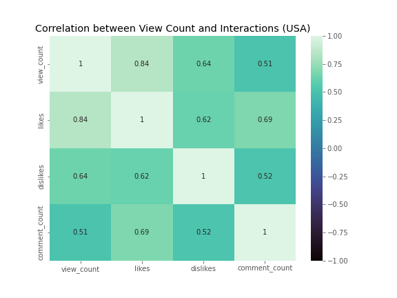
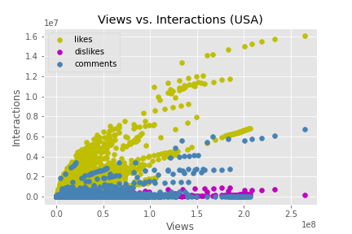
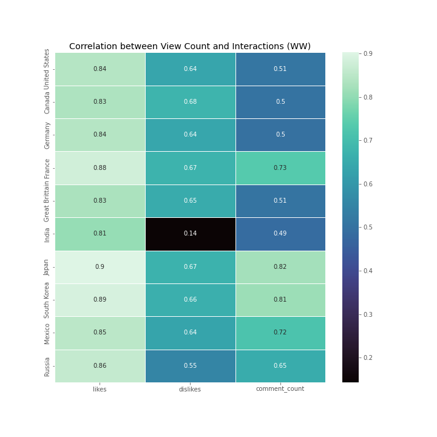
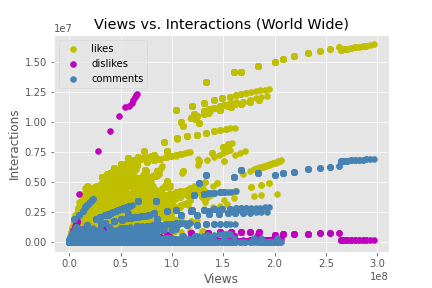

# Motivation
  ***
  
  A trend is defined as the overall direction of a market during a specified period of time. We use this comparative method to research and gather data in order to predict future movements, based on what can be observed in the past. Trending analysis can help spot new trends by looking at past patterns, and also helps us understand the current state of our operations.

  In this project, we are utilizing popular social media platforms such as YouTube to explore video trends and user behaviors to analyze certain factors would determine a trend.
 

# Questions Addressed:  Will number of the views, likes, dislikes, and comments determines the trend?
 

#### Hypothesis:
 
 The relationship between view counts and user interactions will determines if the specific content is trending or not. Higher the view counts, comment counts, number of likes and dislikes will put a video on trending list.
 ***

>Findings and Observations: 

 __[Link to download Youtube Data](https://www.kaggle.com/datasets/rsrishav/youtube-trending-video-dataset)__

To test the theory, we performed the Pearsons correlation coefficient test, to find what our R will be. Our sample data is US data, from 2020-2022, on Youtube Platform. In our findings, we found a strong correlation between view count and user interactions, consist with number of likes, dislikes, and comment counts.

  
This heatmap shows that there is a very strong positive correlation with view count and number of likes, while there is a moderate correlation between view_count and dislikes/comment_count

Based on Pearson correlation values:

   1 = a strong positive correlation

   0 = no correlation

  -1 = strong negative correlation.

However, in this scatter splot, we found that at a certain point, as the view counts continues to increase, the user interactions suddendly dropped significantly. With this finding we reject the hypothesis of having higher views will result in higher user interactions, which leads to trending list. 

To take it even further, we applied the same method with the data of 10 countries (United States, Canada, Germany, France, Great Brittain, India, Japan, South Korea,Mexico, Russia), which we did find similar results as US sample data. 

We can see that all ten countries does have strong correlation between View Counts and nunber of likes. There is an interesting find of India having number of dislikes misrepresented in the data. But without seeing this data in a timelapse format, it's hard to determine if a particular variable is the cause of the other.

This world wide scatter plot demontrates similar trends with US data. This evidence allows us to reject the hypothesis. However, it begs the questions of once the video became trending, does it acquire a new set of viewers that doesn’t like to leave interactions. Or does Youtube algorithm changes after a video became trending? Or is there other determining factors we did not include, such as subscriber count, advertisement friendly content, etc..? 

# Conclusion:
***
Youtube is a reputable platform for mostly Music and Entertainment categories. Youtube public dataset is very detailed allow users to go deep in historical data. The higher number of view count does not correlated with the number of user interactions (comment counts, likes, dislikes), and it certainly is not the main factor to make a trend. 

